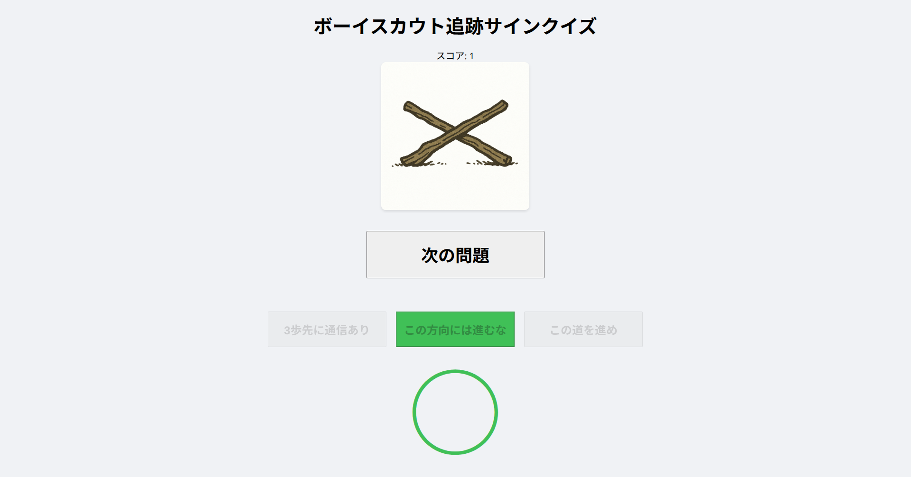

# ボーイスカウト追跡サインクイズ

ボーイスカウトの追跡サインの意味を当てるクイズアプリです。



> ※クイズ内で使用している画像はすべてChatGPTを使って生成しています。

## デプロイURL

[https://scout-tracking-quiz-hiromu-ushiharas-projects.vercel.app/](https://scout-tracking-quiz-hiromu-ushiharas-projects.vercel.app/)

## ローカルでの実行方法

1. リポジトリをクローン
```bash
git clone https://github.com/your-username/scout-tracking-quiz.git
cd scout-tracking-quiz
```

2. 依存関係のインストール
```bash
npm install
```

3. 開発サーバーの起動
```bash
npm start
```

4. ブラウザで確認
- デフォルトで [http://localhost:3000](http://localhost:3000) が開きます

## 使用技術

- React
- Mantine UI
- Vercel (デプロイ)

## 機能

- 追跡サインのクイズ出題
- ランダムに2問を選択
- 選択肢もランダムに表示
- 正解/不正解の表示
- スコアの記録

> ※詳細な仕様については[specification.md](./specification.md)を参照してください。
